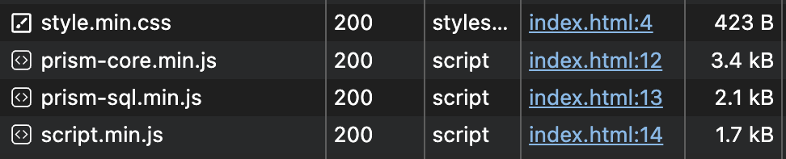

# <ins>Simple</ins> <ins>tiny</ins> <ins>embedded</ins> code editor for <ins>any lang</ins>

###### построено поверх <a href="https://prismjs.com/">prism.js</a> | без npm и node.js 🗑️


<details>
<summary>
<picture></picture>
</summary>
<!-- Разграничитель -->
  <picture>
    <source media="(prefers-color-scheme: dark)" srcset="https://user-images.githubusercontent.com/84059957/215088292-cf50a16b-422b-43cc-a211-c4169553ca62.png">
    <source media="(prefers-color-scheme: light)" srcset="https://user-images.githubusercontent.com/84059957/210322548-b635bad5-c53d-4209-a73e-fb0adcc437bf.png">
    
  </picture>

  Всяко лучше, чем например <a href="https://highlightjs.org/">higlihts.js</a> с их .min весом 36kB. И это только для подсветки, мдыы...
  
  Вес всех файлов после минификаций:

  <picture></picture>

  Ну или применить сжатие, например brotli, то и того меньше, <strong>5.7kB</strong>:
  
  


<!-- Окончание -->
<picture>
    <source media="(prefers-color-scheme: dark)" srcset="https://user-images.githubusercontent.com/84059957/215088776-b06bbe95-42fd-4d78-bcae-70cdbeebbbd3.png">
    <source media="(prefers-color-scheme: light)" srcset="https://user-images.githubusercontent.com/84059957/210319906-4f1e79cb-1a45-4e5c-93e9-ae21e197e0b9.png">
    
  </picture>
</details>

### Суть

`textarea` с `pre` тегом поверх, который абсолютно точно дублирует и красит содержимое.

### Функционал:

- <kbd>Tab</kbd> и <kbd>Shift + Tab</kbd> – Поддержка табуляции 
- <kbd>Ctrl + /</kbd> – Поддержка комментирования через hotkey 
- <kbd>Ctrl + Z</kbd> и <kbd>Shift + Ctrl + Z</kbd> – Поддержка undo/redo. <sub>Хоть и за счёт использования execCommand, который считается deprecated. Однако аналогов пока нет (<a href="https://github.com/fregante/indent-textarea/issues/30">подробнее</a>). А свою микросистему с памятью через самодельный стек сомнительно внедрять...</sub>
- Поддержка resize <sub>(убери resize:none из css)</sub>
- Богатая система классификации:

| Класс            | Что это             | Пример(sql) |
|------------------|---------------------|-------------|
| `.comment`       | Комментарии         | --abc       |
| `.string`        | Строки              | "abc"       |
| `.keyword`       | Ключевые слова      | SELECT      |
| `.punctuation`   | Пунктуация          | ;           |
| `.number`        | Числа               | 123         |
| `.operator`      | Оператор            | BETWEEN     |
| `.boolean`       | Булевое значение    | FALSE       |
| `.function`      | Функции             | COUNT(      |

❗️ Но есть и множество других классов, например 

```css
.url, .property, .selector, .rule {/* в css, например */}

.class-name, .regex {/* js. у regex кста есть и вложенные классы :) */}

.attr-value, .attr-name {/* svg */}
```

> [!IMPORTANT]
> js подключается как clike+js
> ```html
><script src="https://cdnjs.cloudflare.com/ajax/libs/prism/9000.0.1/components/prism-clike.min.js"></script>
><script src="https://cdnjs.cloudflare.com/ajax/libs/prism/9000.0.1/components/prism-javascript.min.js"></script>
> ```
>
> об этом можно легко понять глянув на первые символы `prism-javascript.min.js`:
> ```text
> Prism.languages.javascript=Prism.languages.extend("clike"...)
> ```


### Подсветка любого языка. Как поменять:

- изменить ссылку в index.html (prism-sql.min.js) 
- поменять sql на ваш язык внутри scripts.min.js</sub>
    
---

так как sql модуль prism это не про postgresql, то создал свой модуль `pgSQL.js` с регулярками через chatgpt, ошибки вроде выправил, но не факт что всё 100% идеально.

---

###### js uglified via https://www.uglifyjs.net/
 
###### css minified via https://www.uglifycss.com/
